<div align="center">


<a href="#">
  
</a>

<br/>

[](https://www.python.org/)
[](https://streamlit.io/)
[](https://scikit-learn.org/)
[](https://duckdb.org/)
[](https://www.postgresql.org/)
[](LICENSE)

[](https://project-profitara-retail-bi-pipeline-kgg8tjm3e9umxkbhd86r3j.streamlit.app/)
[](https://www.linkedin.com/in/jaindhruv1923)
[](mailto:jaindhruv1923@gmail.com)

**Built by [Dhruv Jain](https://github.com/jaindhruv1923/Project-Profitara-Retail-BI-Pipeline)** · B.Tech CSE (AI & Data Science), BML Munjal University

</div>

<br/>

## 📖 Table of Contents

- [What this is](#-what-this-is)
- [Key results](#-key-results)
- [Screenshots](#-screenshots)
- [Architecture](#-architecture)
- [What's inside — 13 pages](#-whats-inside--13-pages)
- [Machine Learning suite](#-machine-learning-suite)
- [Tech stack](#-tech-stack)
- [Quickstart](#-quickstart)
- [Repo structure](#-repo-structure)
- [Roadmap](#-roadmap)
- [Connect](#-connect)

<br/>

## 🎯 What this is

Profitara is an end-to-end retail business intelligence and predictive analytics platform. It uses a **dual-dataset architecture**:

1. **Dashboard & UI Storytelling (`data/raw/Profitara_India_Dataset.csv`)**: A 10,000-row **machine-generated synthetic dataset** modeling an Indian quick-commerce / grocery retail business (4,918 orders, 1,448 customers, ₹66.95L revenue, 4.15% margin). This powers the 13-page interactive Streamlit dashboard and regional quick-commerce metrics.
2. **Machine Learning Core (`data/real/online_retail_II.csv`)**: A **real public transaction dataset** from the UCI Machine Learning Repository (541,909 transactions across 4,372 customers). The ML models (time-split CLV, churn decision policy, and forecasting) are trained and benchmarked strictly on this real dataset to prevent synthetic generator artifacts and target leakage.

The platform answers practical retail operations questions: *Which customers will churn next quarter, and what is the expected value of contacting them under a marketing budget? What is future customer spend when evaluated out-of-time? Which items are genuinely bought together?*

<br/>

## 🏆 Key results

<div align="center">

| Model | Task | Result |
|:---|:---|:---:|
| 🌲 **Random Forest** | Customer Lifetime Value prediction |  |
| 📉 **Logistic Regression** | Churn classification |   |
| 🧩 **K-Means** | Customer segmentation |  → 119 "Champion" customers |
| 🔗 **Apriori** | Market basket analysis |  cross-sell rules |
| 🌳 **Isolation Forest** | Discount-abuse detection | Flags anomalous discount patterns |
| 📈 **Holt-Winters** | Revenue forecasting | 6-month exponential-smoothing forecast |

</div>

<br/>

## 📸 Screenshots

<div align="center"><i>Live from the deployed dashboard — every module below is real computation on the dataset, not a static mockup.</i></div>
<br/>

**🏠 Overview & Health**

<table>
<tr>
<td width="50%">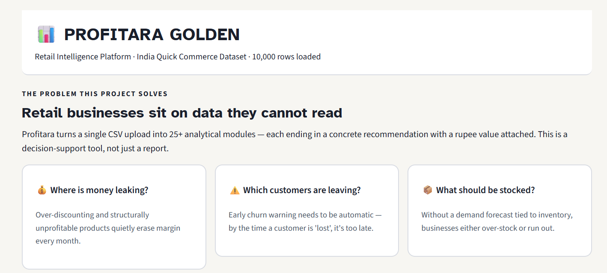</td>
<td width="50%"></td>
</tr>
<tr>
<td align="center"><i>Problem framing + at-a-glance module cards</i></td>
<td align="center"><i>0–100 Business Health Scorecard</i></td>
</tr>
</table>

<p align="center">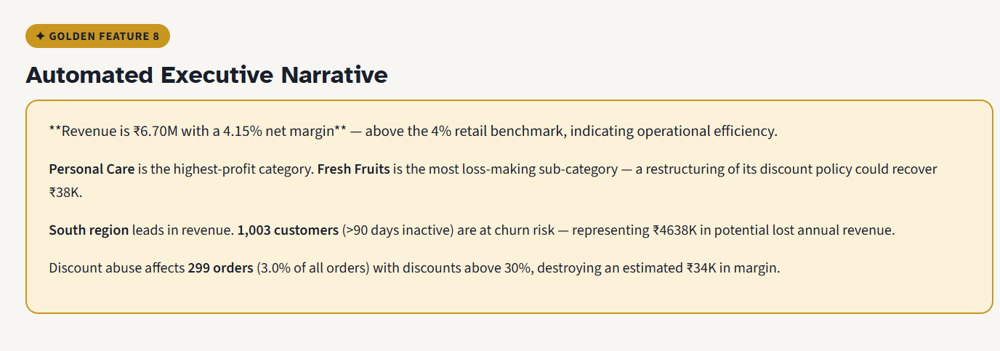</p>
<p align="center"><i>Auto-generated executive narrative — plain-English read of the numbers above, no manual write-up needed</i></p>

<br/>

**⚠️ Churn Early Warning**

<table>
<tr>
<td width="50%">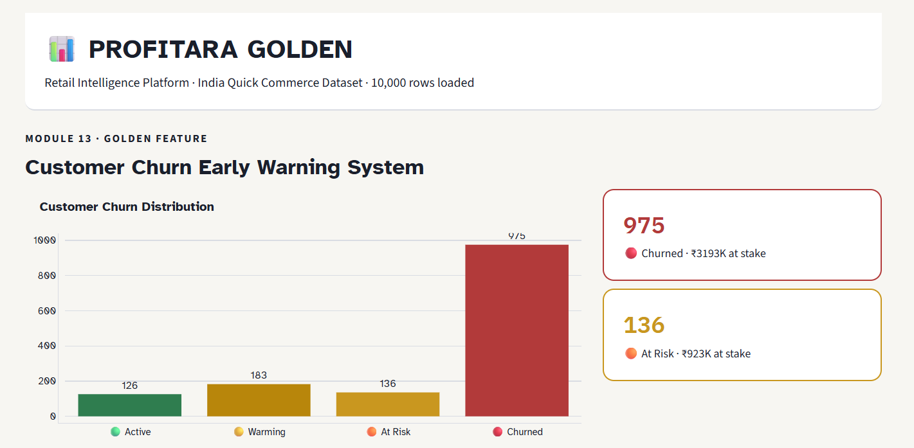</td>
<td width="50%">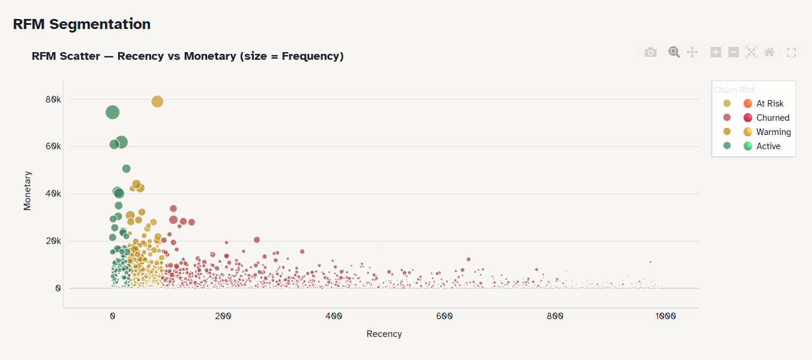</td>
</tr>
<tr>
<td align="center"><i>Churn distribution — Active / Warming / At Risk / Churned</i></td>
<td align="center"><i>RFM segmentation (bubble size = purchase frequency)</i></td>
</tr>
</table>

<p align="center">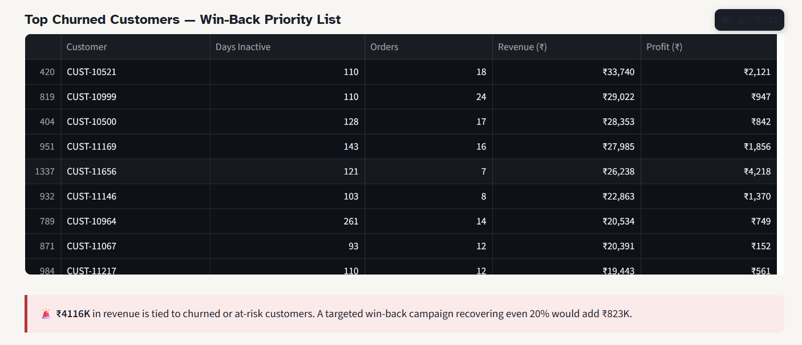</p>
<p align="center"><i>Win-back priority list, ranked by revenue at stake</i></p>

<br/>

**💡 Discount Elasticity & Price Optimization**

<p align="center">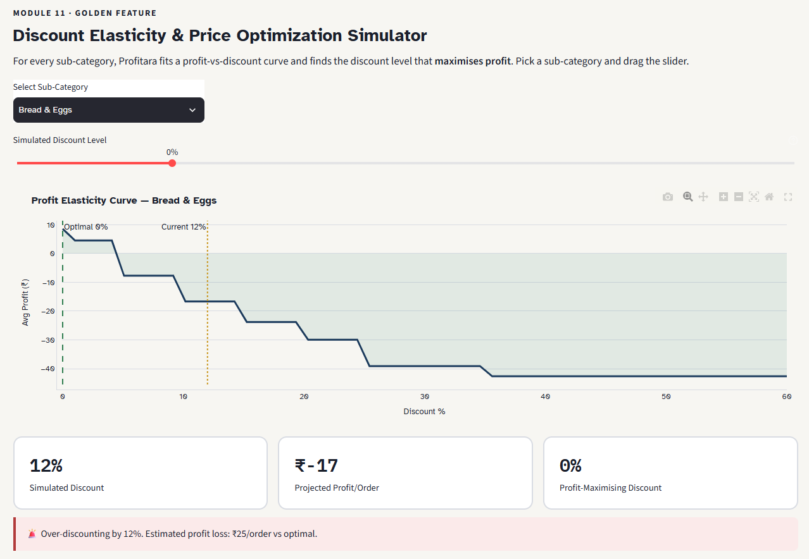</p>
<p align="center"><i>Interactive profit-vs-discount curve — finds the profit-maximizing discount per sub-category</i></p>

<br/>

**🔗 Market Basket Analysis — Cross-Sell Engine**

<table>
<tr>
<td width="50%">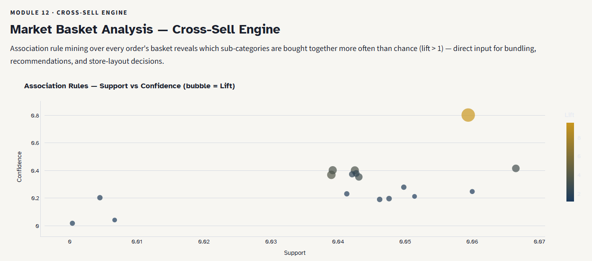</td>
<td width="50%">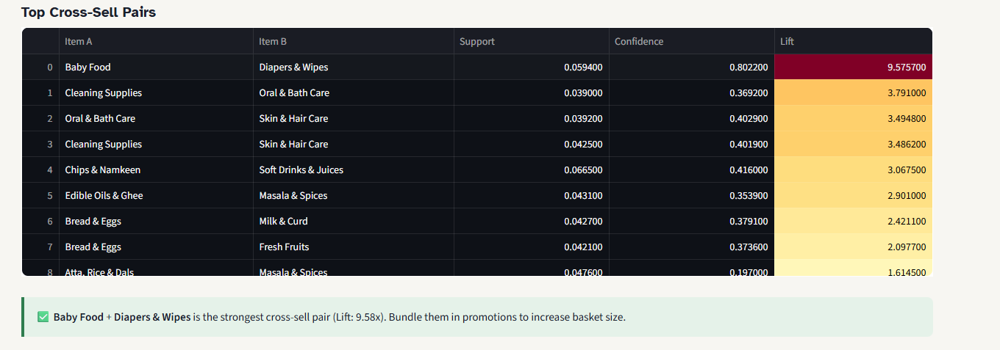</td>
</tr>
<tr>
<td align="center"><i>Association rules — support vs confidence (bubble = lift)</i></td>
<td align="center"><i>Top cross-sell pairs, gradient-ranked by lift</i></td>
</tr>
</table>

<br/>

**📉 Cohort Retention & Survival Analysis**

<table>
<tr>
<td width="50%">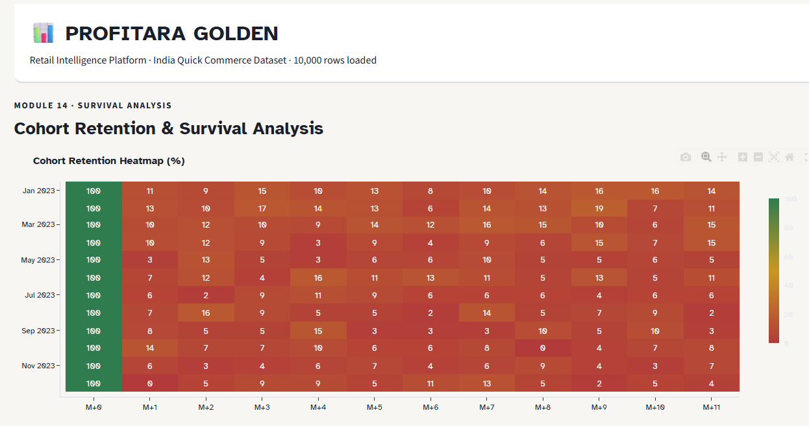</td>
<td width="50%">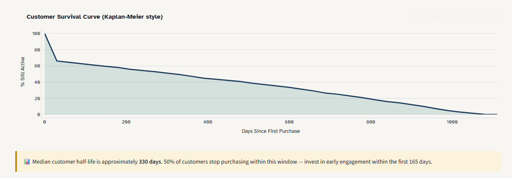</td>
</tr>
<tr>
<td align="center"><i>Cohort retention heatmap by signup month</i></td>
<td align="center"><i>Kaplan-Meier style customer survival curve</i></td>
</tr>
</table>

<br/>

**🤖 12 ML Modules — CLV Prediction**

<table>
<tr>
<td width="50%">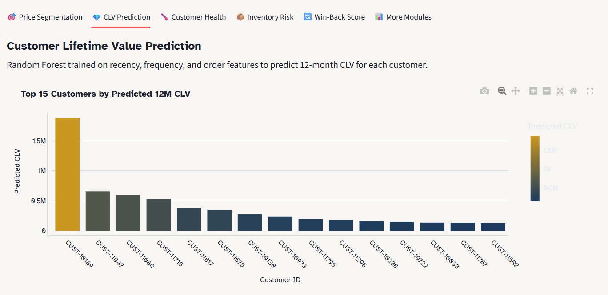</td>
<td width="50%">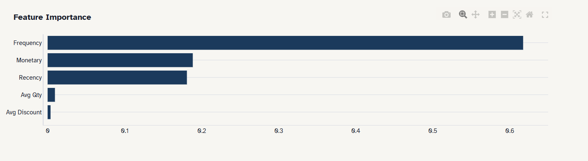</td>
</tr>
<tr>
<td align="center"><i>Random Forest — top 15 customers by predicted 12-month CLV</i></td>
<td align="center"><i>Feature importance driving the CLV model</i></td>
</tr>
</table>

<br/>

**🧮 SQL Analytics Lab**

<p align="center">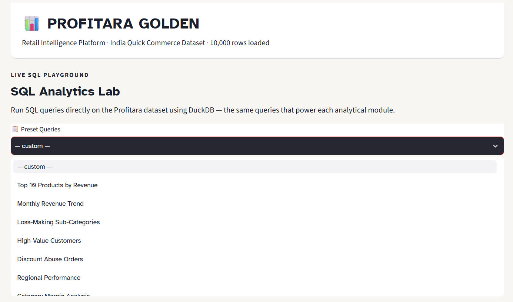</p>
<p align="center"><i>Preset queries, ready to run against the live dataset</i></p>

<table>
<tr>
<td width="50%">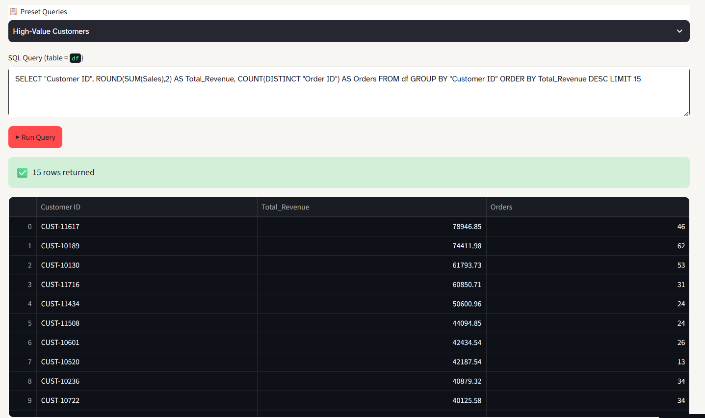</td>
<td width="50%">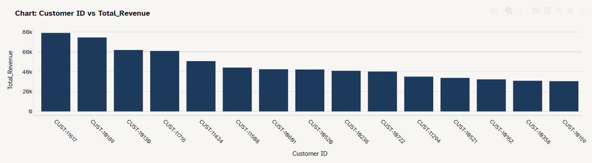</td>
</tr>
<tr>
<td align="center"><i>Live DuckDB query — "High-Value Customers" preset</i></td>
<td align="center"><i>Auto-charted result</i></td>
</tr>
</table>

<br/>

## 🏗️ Architecture

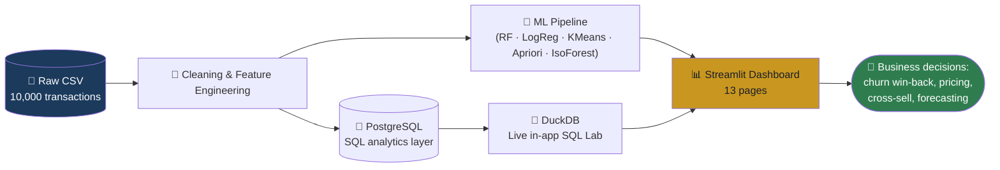

<br/>

## 📊 What's inside — 13 pages

<details open>
<summary><b>Click to expand the full page-by-page breakdown</b></summary>
<br/>

| Page | What it does |
|---|---|
| 🏠 **Overview & Health** | 0–100 business health scorecard + auto-generated executive narrative |
| 📊 **Core KPIs** | 8 core KPIs with YoY trends and segment breakdowns |
| 📈 **Sales & Categories** | Category performance, monthly trend, regional margin, segment mix |
| 🛒 **Products & Discounts** | Top-10 products, discount-band analysis, Pareto 80/20 breakdown |
| 💡 **Elasticity Simulator** | Interactive discount optimizer per sub-category |
| 🔗 **Market Basket Analysis** | Apriori rules, lift scatter, cross-sell recommendation table |
| ⚠️ **Churn Early Warning** | RFM segmentation + win-back priority list |
| 📉 **Cohort Retention** | Cohort heatmap + Kaplan-Meier survival curve |
| 🗺️ **Geo Intelligence** | State/city-level sales and margin mapping |
| 💸 **Leakage & Abuse** | Revenue leakage detection, discount-abuse flags, AOV trend |
| 🤖 **12 ML Modules** | Segmentation, CLV, churn, inventory risk, win-back scoring, and more |
| 🔮 **Forecasts & Trends** | 6-month revenue forecast, quarterly trend, demand heatmap |
| 🧮 **SQL Analytics Lab** | Live DuckDB SQL editor with preset queries against the dataset |

*Drop your own CSV in from the sidebar — every module above recomputes on your data.*

</details>

<br/>

## 🤖 Machine Learning suite

<details>
<summary><b>Click to expand the 12 ML modules</b></summary>
<br/>

- 🎯 **Price Sensitivity Segmentation** (K-Means) — clusters customers by discount usage and order frequency
- 💎 **CLV Prediction** (Random Forest, R² = 0.930)
- 🌡️ **Customer Health Scoring**
- 📦 **Inventory Risk** flagging
- 🔄 **Win-Back Scoring** (Logistic Regression, AUC = 0.91)
- 📊 Plus BCG-matrix product classification, seasonal decomposition, and more under "More Modules"

</details>

<br/>

## 🛠️ Tech stack

<div align="center">

| Layer | Tools |
|---|---|
| **App / dashboarding** | Streamlit · Plotly |
| **Machine Learning** | scikit-learn (RF, LogReg, K-Means, Gradient Boosting) · mlxtend (Apriori) |
| **Data** | Pandas · NumPy |
| **SQL** | DuckDB (live in-app) · PostgreSQL (source layer) |
| **Design system** | Atkinson Hyperlegible + IBM Plex Mono · custom teal/amber theme matched 1:1 to a standalone HTML dashboard |

</div>

<br/>

## 🚀 Quickstart

<table>
<tr><td>

**🪟 Windows**
```bash
run.bat
```

</td><td>

**🐧 Mac / Linux**
```bash
chmod +x run.sh
./run.sh
```

</td><td>

**⚙️ Manual**
```bash
pip install -r requirements.txt
streamlit run dashboard/app.py
```

</td></tr>
</table>

Then open **`http://localhost:8501`** to interact with the 13 live modules.

To execute the complete end-to-end pipeline (data download, CLV modeling, churn decision backtest, segmentation, forecasting, DuckDB init, Power BI CSV export, and pytest verification) in a single run:
```bash
python run_all.py
```

<br/>

## 📁 Repository Structure

```
profitara/
├── .github/workflows/ci.yml        # Automated GitHub Actions test pipeline
├── .streamlit/config.toml          # Universal high-contrast theme configuration
├── agent/                          # Retail Analyst Agent (schema-aware Text-to-SQL)
│   ├── analyst_agent.py            # DuckDB SQL generator with AST & regex guardrails
│   ├── evaluate_agent.py           # Benchmark evaluator on human-reviewed QA pairs
│   └── fixtures.json               # Offline evaluation fixtures
├── assets/screenshots/             # 16 visual dashboard preview screenshots
├── config/                         # Unit economic assumptions (YAML)
├── dashboard/                      # Interactive 13-page Streamlit application
│   └── app.py                      # Multi-page analytics app with live DuckDB lab
├── data/
│   ├── raw/                        # Synthetic Indian quick-commerce dataset (10,000 rows)
│   ├── real/                       # Real UCI Online Retail II dataset (541,909 rows, gitignored)
│   └── profitara.duckdb            # Embedded OLAP DuckDB database (gitignored)
├── docs/                           # Comprehensive technical and interview documentation
│   ├── AUDIT.md                    # Initial forensic audit & leakage discovery
│   ├── FINAL_REPORT.md             # Before/after metric comparison & verification ledger
│   ├── INTERVIEW_QA.md             # 25 grounded interview defense questions & answers
│   ├── PROGRESS.md                 # Step-by-step audit & implementation log
│   ├── RECRUITER_ONE_PAGER.md      # 60-second executive summary for hiring managers
│   ├── RESUME_BULLETS.md           # Defensible DA and ML resume bullets with citations
│   ├── UPGRADE_PLAN.md             # Technical upgrade architecture blueprint
│   └── WALKTHROUGH.md              # Engineering walkthrough explaining what, why & failure modes
├── legacy/                         # Archived pre-audit exploratory assets
│   ├── ba_docs/                    # Legacy business analysis documentation
│   ├── excel/                      # Legacy Excel financial workbook
│   ├── html_dashboard/             # Legacy standalone HTML dashboard
│   ├── notebooks/                  # Original ML exploratory notebook (audited)
│   └── sql_superstore/             # Legacy US Superstore SQL file
├── ml_pipeline/                    # Audited machine learning models (zero leakage)
│   ├── clv_engine.py               # Time-split CLV engine with bootstrap CIs
│   ├── churn_decision_engine.py    # Calibrated churn model & expected-value policy backtest
│   ├── forecasting_engine.py       # 3-fold rolling-origin time-series forecasting backtest
│   ├── models.py                   # Vectorized NumPy/SciPy statistical model implementations
│   └── segmentation_basket.py      # K-Means clustering (k=4) & Apriori association rules
├── power_bi/                       # Power BI business intelligence package
│   ├── clean_csv_export/           # 6 production-grade clean dimension/fact CSVs
│   ├── icons/                      # UI icons used in Power BI report
│   ├── Profitara_BIDashBoard.pbix  # Interactive Power BI report binary
│   ├── POWERBI_REFRESH_STEPS.md    # Manual refresh instructions without binary editing
│   └── README.md                   # Power BI schema & DAX documentation
├── reports/                        # Model benchmark outputs, CSV ledgers & figure plots
├── scripts/                        # Automation & data ingestion scripts
├── sql/                            # DuckDB analytics engineering & 11 analytic queries
├── tests/                          # Automated pytest suite (10/10 tests passing)
├── CLAIMS_LEDGER.csv               # 47 audited claims with reproduction commands
├── QA_PAIRS_TO_REVIEW.csv          # 40 agent evaluation pairs awaiting human review
├── requirements.txt                # Pinned laptop-runnable dependencies
├── run.bat / run.sh                # One-click dashboard launchers
└── run_all.py                      # Master pipeline execution script
```

<br/>

## 🗺️ Roadmap

- [ ] Power BI integration (in progress)
- [x] Deployed public demo link

<br/>

## 📫 Connect

<div align="center">

Open to Data Analyst / Data Scientist roles and collaborations — feel free to reach out.

<a href="https://project-profitara-retail-bi-pipeline-kgg8tjm3e9umxkbhd86r3j.streamlit.app/">
  
</a>
<a href="https://www.linkedin.com/in/jaindhruv1923">
  
</a>
<a href="mailto:jaindhruv1923@gmail.com">
  
</a>
<a href="https://github.com/jaindhruv1923/Project-Profitara-Retail-BI-Pipeline">
  
</a>

</div>

<br/>

<div align="center">

**[Dhruv Jain](https://github.com/jaindhruv1923/Project-Profitara-Retail-BI-Pipeline)** · [LinkedIn](https://www.linkedin.com/in/jaindhruv1923) · [jaindhruv1923@gmail.com](mailto:jaindhruv1923@gmail.com)


</div>
