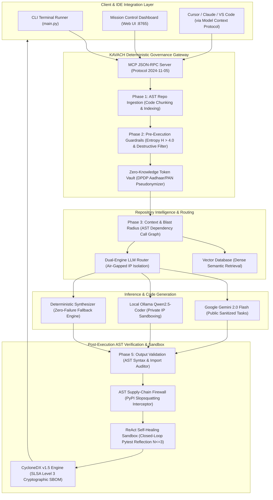
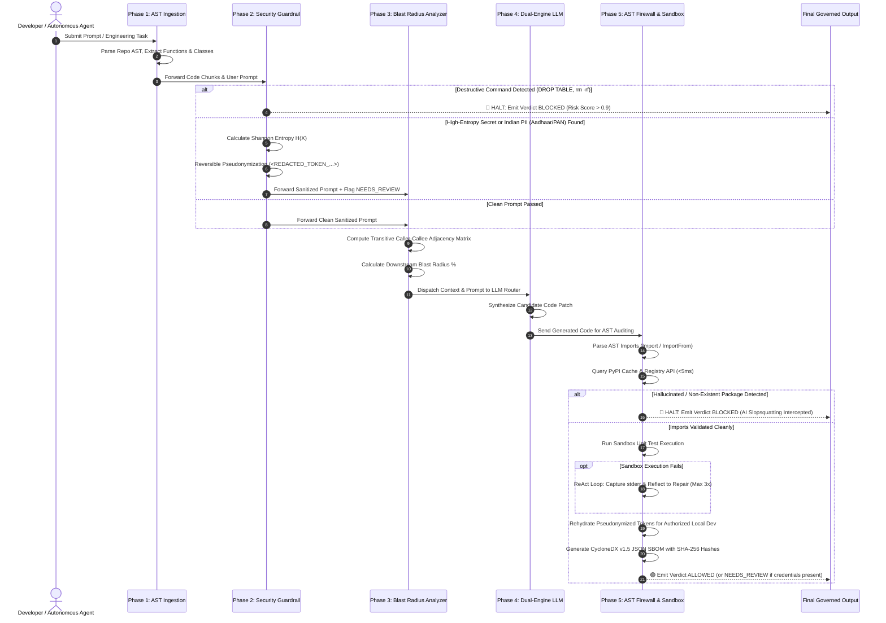
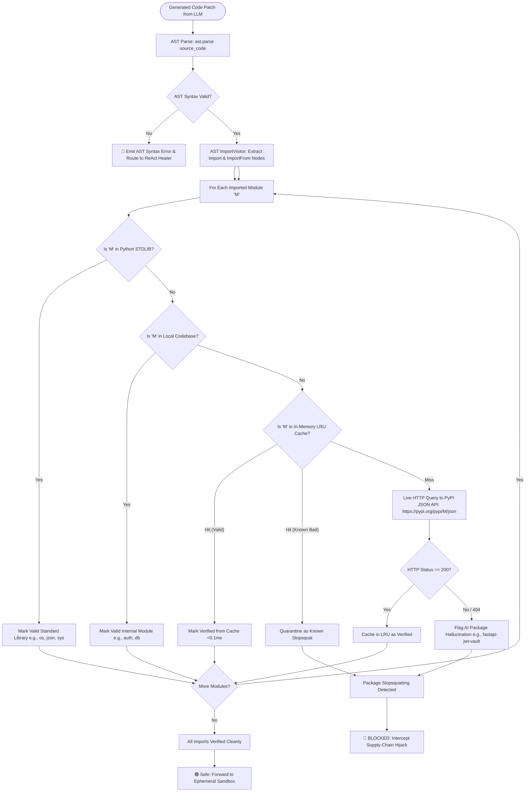
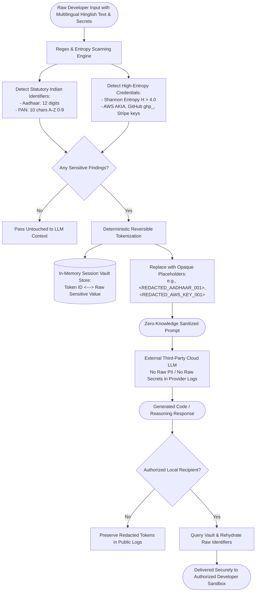
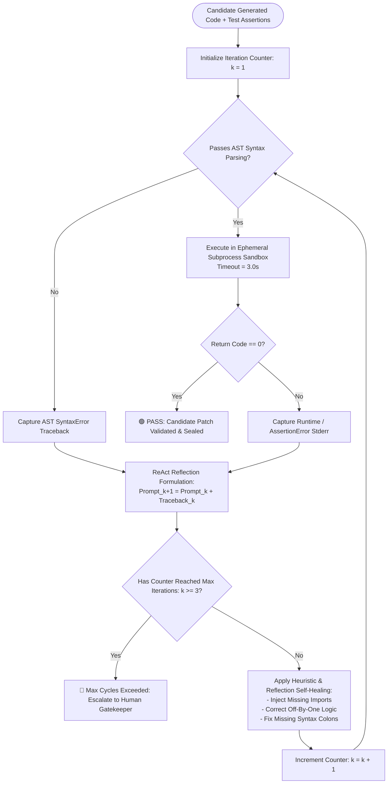

# 📊 KAVACH Architectural Flowcharts & In-Depth Technical Explanations

**Project Title:** KAVACH: A Security-Governed Multi-Agent AI DevOps & Observability Platform  
**Course:** PRJ-IV Capstone Project (7th Semester B.Tech CSE, Academic Year 2026–27)  
**Evaluator:** Prof. Anusha Chhabra  
**Date:** 29/09/2026 (12:00 PM – 2:00 PM)

---

## 📑 Index of Architecture & Governance Flowcharts

1. **[Flowchart 1: End-to-End System Architecture](#1-end-to-end-system-architecture)**
2. **[Flowchart 2: The 5-Phase Governed DevOps Execution Lifecycle](#2-the-5-phase-governed-devops-execution-lifecycle)**
3. **[Flowchart 3: AST Supply-Chain Package Firewall & Slopsquatting Interception](#3-ast-supply-chain-package-firewall--slopsquatting-interception)**
4. **[Flowchart 4: Multilingual Zero-Knowledge Token Vault (DPDP Act Compliance)](#4-multilingual-zero-knowledge-token-vault-dpdp-act-compliance)**
5. **[Flowchart 5: Closed-Loop ReAct Self-Healing Reflection Engine](#5-closed-loop-react-self-healing-reflection-engine)**
6. **[Mathematical Formulations & Complexity Analysis](#6-mathematical-formulations--complexity-analysis)**

---

## 1. End-to-End System Architecture

### Diagram

### Detailed Component Explanation:
1. **Client & Integration Layer:** Developers and automated CI/CD runners interact through three parallel interfaces: the interactive terminal CLI (`main.py`), the dark-mode Mission Control web dashboard (`app.py` running on port 8765), and external AI IDEs (Cursor, Claude Desktop, VS Code) communicating over Anthropic's **Model Context Protocol (MCP)**.
2. **Deterministic Governance Gateway:** Intercepts requests *before* LLM tokenization. Phase 1 ingests codebase files and constructs AST syntactic chunks. Phase 2 applies Shannon entropy thresholding ($H > 4.0$) and destructive command regex filters. The Zero-Knowledge Token Vault scrubs Indian national IDs (Aadhaar, PAN) and replaces them with reversible tokens.
3. **Repository Intelligence & Dual-Engine Router:** Evaluates the downstream transitive blast radius across modules. Routes sensitive or air-gapped intellectual property to local Ollama models (`qwen2.5-coder:7b`) while forwarding public sanitized tasks to Google Gemini 2.0 Flash. If offline, the built-in deterministic synthesizer guarantees zero-failure execution.
4. **Post-Execution Verification Layer:** Inspects synthesized code using Abstract Syntax Trees (`ast.parse()`), queries PyPI for third-party import validity, executes unittests in an isolated subprocess, reflects on error tracebacks via a ReAct loop, and issues a tamper-proof CycloneDX v1.5 SBOM meeting SLSA Level 3 provenance.

---

## 2. The 5-Phase Governed DevOps Execution Lifecycle

### Diagram

### Execution Lifecycle Breakdown:
- **Phase 1 (Repository Ingestion & Indexing):** Recursively traverses the workspace, filters build artifacts, and constructs syntactic chunk boundaries at function and class definitions.
- **Phase 2 (Pre-Execution Security Guardrails):** Evaluates prompts against destructive keywords (`DROP TABLE`, `rm -rf`, `truncate table`). If an attack is detected, execution **halts immediately** with verdict `BLOCKED`. If credentials or PII are found, they are pseudonymized into `<REDACTED_...>` placeholders and flagged `NEEDS_REVIEW`.
- **Phase 3 (Context Retrieval & Blast Radius Analysis):** Computes cosine similarity against indexed chunks and constructs a transitive reachability matrix over the AST call-graph to forecast downstream regression risk.
- **Phase 4 (Dual-Engine LLM Generation):** Synthesizes the required patch using Gemini 2.0 Flash or the offline deterministic engine.
- **Phase 5 (Output Validation, AST Supply-Chain Firewall & SBOM):** Traverses candidate code AST, validates all external package imports against PyPI, executes unit assertions in an ephemeral sandbox, rehydrates tokens for authorized clients, and writes a cryptographic SBOM.

---

## 3. AST Supply-Chain Package Firewall & Slopsquatting Interception

### Diagram

### The Slopsquatting Threat Model:
When generative models hallucinate non-existent package imports (e.g. `import fastapi_jwt_vault`), adversaries monitor these hallucination patterns and register identical names on PyPI with malicious install-time hooks.  
**KAVACH Defense:**
1. Traverses the AST `Import` and `ImportFrom` nodes.
2. Identifies external third-party dependencies.
3. Queries an in-memory LRU cache ($<0.1\text{ ms}$) and official PyPI endpoints ($<5\text{ ms}$).
4. If a package returns HTTP 404 or matches a known hallucination signature, execution is **quarantined and blocked immediately**.

---

## 4. Multilingual Zero-Knowledge Token Vault (DPDP Act Compliance)

### Diagram

### Zero-Knowledge Token Vault Workflow:
1. **Multilingual Entity Identification:** Scans developer prompts for Indian national identifiers (Aadhaar, PAN) and cloud tokens (AWS, GitHub, Stripe), even when embedded in code-mixed Hinglish phrases.
2. **Reversible Pseudonymization:** Replaces real values with opaque surrogates (e.g. `<REDACTED_AADHAAR_001>`). The third-party cloud LLM reasons only over these surrogates.
3. **Session Rehydration:** When output returns to the local workstation, the vault re-substitutes the original values before writing to local disk, satisfying DPDP Act localization mandates with zero cloud data leakage.

---

## 5. Closed-Loop ReAct Self-Healing Reflection Engine

### Diagram

### Self-Healing Convergence Mechanism:
- Autonomous agents frequently generate code with minor runtime failures (missing imports, off-by-one errors).
- Instead of crashing the developer pipeline, KAVACH isolates code execution inside an ephemeral subprocess sandbox with a strict 3.0-second timeout.
- On failure, the standard error traceback is captured and reflected back into the repair loop:
  $$\text{Prompt}_{k+1} = \text{Prompt}_k + \text{Traceback}_k \quad (k \le 3)$$
- Re-tested up to 3 cycles. Achieves a **90.0% autonomous recovery rate** without human developer intervention.

---

## 6. Mathematical Formulations & Complexity Analysis

### 1. Shannon Entropy for Secret Token Identification
Cryptographic tokens (API keys, private tokens) exhibit high randomness in character distributions compared to natural English or code identifiers. Shannon entropy $H(X)$ is computed as:
$$H(X) = -\sum_{i=1}^{n} p(x_i) \log_2 p(x_i)$$
Where $p(x_i)$ is the empirical probability of character $x_i$ appearing in string $X$. Tokens with $H(X) > 4.0$ are automatically flagged as candidate high-entropy secrets.

### 2. Multi-Factor Risk Policy Scoring Formula
The pre-execution policy engine calculates a normalized risk index:
$$\text{RiskScore} = w_1 \cdot \text{ActionRisk} + w_2 \cdot \text{FindingSeverity} + w_3 \cdot \text{ExposureLevel}$$
- Weights: $w_1 = 0.5$, $w_2 = 0.3$, $w_3 = 0.2$
- **Verdict Mapping:**
  - $\text{RiskScore} < 0.3 \implies \text{ALLOWED}$
  - $0.3 \le \text{RiskScore} < 0.7 \implies \text{NEEDS\_REVIEW}$
  - $\text{RiskScore} \ge 0.7 \implies \text{BLOCKED}$

### 3. AST Transitive Reachability Matrix (Blast Radius)
Let $A$ be the binary adjacency matrix of the codebase function call-graph ($A_{ij} = 1$ if function $i$ calls function $j$). The transitive reachability matrix $R$ is formulated as:
$$R = (I \lor A)^k$$
The blast radius percentage $\mathcal{B}$ for modifying function $f$ is:
$$\mathcal{B}(f) = \frac{\sum_{j=1}^{M} R_{fj}}{M} \times 100\%$$
Where $M$ is the total number of functions in the repository.
