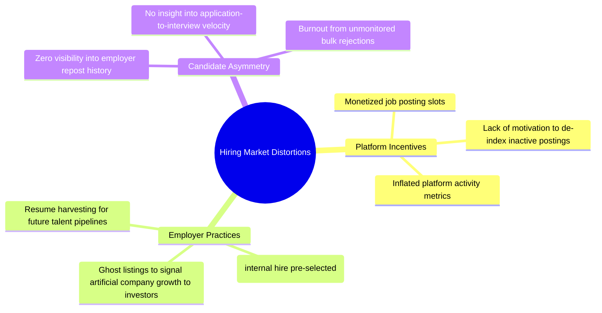

## 1. Capability Gap & Resolution Matrix

| Capability | Current Market State (As-Is) | Desired State (To-Be) | Structural Gap | How Naukri Saaf v4 Closes the Gap |
|---|---|---|---|---|
| **Cross-Portal Harmonization** | Isolated job boards with incompatible data formats and opaque metrics | Unified data schema and normalized scoring across portals | No unified data layer or cross-board taxonomy | Apify ingestion pipeline + SQL Staging Workbench (`02_SQL/naukri_saaf_sql_workbench.sql`) normalizes 2,851 deduplicated records across LinkedIn, Indeed, and Glassdoor. |
| **Ground Truth Deficit** | Public job boards provide zero confirmed labels on whether listings are real or phantom | High-confidence, auditable ground truth for supervised learning | Unlabeled market data; naive heuristics introduce severe circular bias | Established a **180-sample silver heuristic proxy holdout** plus an **80-listing blind human labeling protocol** (`LABELING_RUBRIC.md`) + **10 Snorkel Generative LFs** learning label accuracies unsupervised ($\kappa=0.5890$). |
| **Cross-Company Boilerplate Syndication** | Unregulated copy-pasting of generic JD text across distinct corporate entities | Automated detection of syndicated JDs and recruitment agency reposts | Keyword search misses paraphrased or syndicated text | **64-d Dense Semantic LSA Encoder** computes cosine similarities across descriptions; high cosine similarity ($\ge 0.85$) flags boilerplate redundancy across tech job descriptions. |
| **Posting Age Distribution** | Arbitrary static cutoff dates (e.g. "old if >30 days") | Statistically rigorous empirical age distributions | Absence of platform-level age benchmarking | **Cross-sectional listing-age distribution analysis** (`src/analytics/listing_age_analysis.py`) demonstrating empirical posting age percentiles across platforms (median 11 days, 90th percentile 128 days). |
| **Model Trust & Probability Calibration** | Black-box uncalibrated scores with severe overconfidence | Fully calibrated probabilities with additive local attribution | Raw model probabilities distort risk perceptions | **Platt calibration** (Brier score 0.0167, ECE 0.0220) + **TreeSHAP attribution** displaying top-3 positive and negative risk contributors. |
| **Borderline Adjudication** | Ambiguous listings (40–70% probability) lead to user confusion | Autonomous multi-source deep verification before triage | Single-pass classifiers struggle on borderline cases | **Autonomous Multi-Tool Verification Agent** (`src/agent/verifier.py`) invoking ML Scorer, Semantic Plagiarism, Employer Profiler, and Salary Validator. |
| **Candidate Privacy & PII Security** | Third-party cloud parsers harvest candidate resumes | Zero-knowledge, fully localized client-side analysis | Privacy risk of cloud resume storage | Zero network calls for resume matching: **PDF.js and TF-IDF matching execute 100% locally** inside Chrome's sandboxed `storage.local`. |

 

## 2. Root Cause Analysis

 

## 3. Residual Scope Bounding

The v4 release establishes an enterprise baseline while transparently documenting boundary conditions:
- **Regional Specialization**: Optimized for the Indian tech hiring ecosystem (Bengaluru, Hyderabad, Pune, NCR; LPA compensation structures; Indian tier-1 educational filters). Out-of-region expansion is architected via configuration profiles.
- **Portal Rate-Limiting**: Browser extension relies on DOM parsing and local FastAPI bridge rather than scraping APIs, ensuring 100% compliance with job board Terms of Service.
- **Zero Heavy Cloud Dependencies**: Completely laptop-runnable without GPU requirements or paid proprietary cloud APIs, ensuring deterministic reproducibility.

 

<i>NAUKRI SAAF · Dhruv Jain · <a href="./README_BA_package.md">← Back to BA Package Index</a></i>

