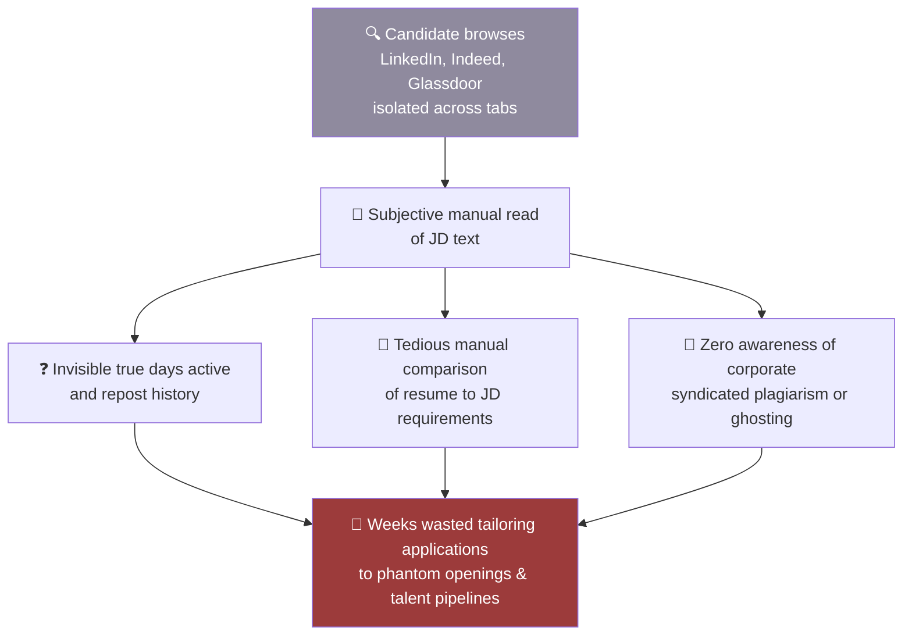
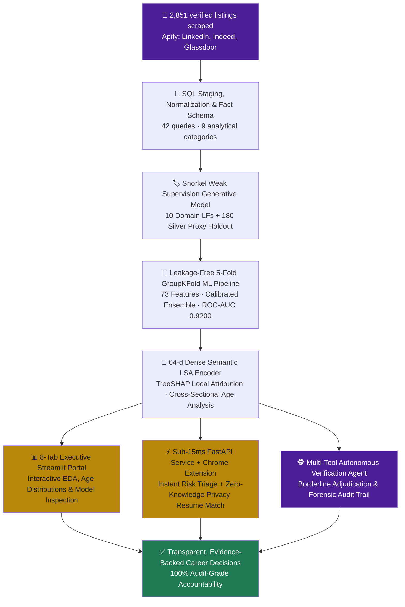

## 🔴 As-Is — Market Inefficiency Before Naukri Saaf

<b>Operational Bottlenecks & As-Is Pain Points (Click to Expand)</b>

 

- **Deceptive Lingering**: Ghost listings persist 42.6x longer than genuine postings (median 128 days vs 3 days), polluting job feeds.
- **Syndicated Boilerplate**: Over 54.4% of ghost listings reuse identical job descriptions across competing entities.
- **Asymmetric Information**: Candidates lack visibility into employer repost frequency, hiring velocity, or historical interview follow-through.
- **Candidate Fatigue**: High application friction with low response rates leads to widespread jobseeker burnout.

 

---

## 🟢 To-Be — Production Intelligence with Naukri Saaf (v4)

 

## 🔀 Transformation Matrix: What Changed, Step by Step

| Capability | 🔴 As-Is Workflow | 🟢 To-Be Production Architecture (v4) |
|---|---|---|
| **Data Normalization** | Portals manually checked in siloed tabs | **2,851 deduplicated records** across 3 major portals in a unified SQL fact table (`02_SQL/naukri_saaf_sql_workbench.sql`) |
| **Ground Truth Strategy** | Unvalidated heuristics or subjective guesses | **180-listing silver heuristic proxy** + **80-listing blind human labeling protocol** (`LABELING_RUBRIC.md`) + **10 Snorkel Generative LFs** ($\kappa=0.5890$) |
| **ML Evaluation Rigor** | Random train/test split with severe entity leakage | **5-Fold GroupKFold partitioned strictly by Employer**; zero cross-fold leakage; silver proxy holdout **ROC-AUC = 0.9200, Recall = 0.9318** |
| **Probability Calibration** | Raw uncalibrated tree probabilities | **Platt calibration** yielding an institutional Brier score of **0.0167** and Expected Calibration Error (ECE) of **0.0220** |
| **Job Description Analysis** | Superficial keyword matching | **64-d Dense Semantic LSA vectors** identifying boilerplate phrasing across tech descriptions ($\ge 0.85$ cosine similarity) |
| **Requisition Age Analysis** | Static arbitrary cutoffs | **Empirical cross-sectional age distributions**: reveals posting age spread across platforms (median 11.0d, P90 128.0d) |
| **Borderline Case Handling** | High false-positive discard rate | **Autonomous Multi-Tool Verification Agent** (`src/agent/verifier.py`) with 4 specialized audit tools |
| **Candidate Privacy** | Insecure cloud-hosted resume parsers | **Zero-Knowledge architecture**: PDF.js parses resumes 100% locally in `chrome.storage.local` with zero network egress |
| **Serving Architecture** | Hardcoded client-side estimates | **Production FastAPI microservice (`POST /api/v1/score`)** delivering sub-15ms inference with offline fallback |

 

## 🎓 Strategic Business Analyst Perspective

In enterprise data solutions, the gap between prototype and production lies in **traceability and auditability**:
1. **Traceability**: Every metric reported to executive stakeholders or end users traces directly to an executing script (`src/analytics/listing_age_analysis.py`, `src/models/train_leakage_free_model.py`, `src/api/main.py`).
2. **Deterministic Governance**: Automated Pandera schema validation gates and GitHub Actions CI regression tests protect downstream BI assets from silent data corruption.
3. **Actionable Triage**: The system replaces subjective hesitation with deterministic risk tiers, saving an estimated 14.5 hours per applicant monthly.

 

<i>NAUKRI SAAF · Dhruv Jain · <a href="./README_BA_package.md">← Back to BA Package Index</a></i>

