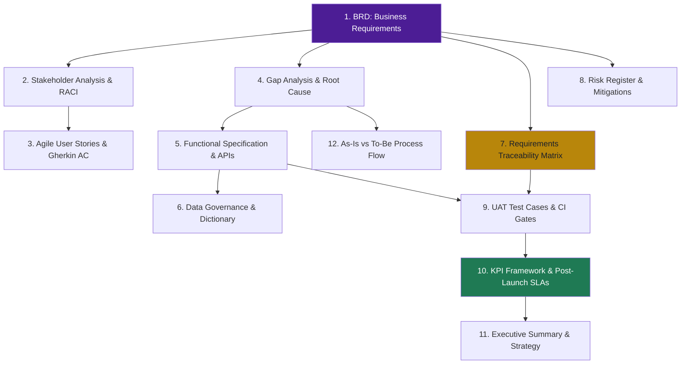

## 📁 What's in this Package

Every standard enterprise Business Analysis deliverable, built strictly against the real **Naukri Saaf v4 Production Pipeline** (2,851 clean deduplicated listings across LinkedIn, Indeed, Glassdoor → 42 SQL workbench queries → 10 Snorkel weak-supervision LFs + 180-sample silver proxy holdout + 80-listing blind human labeling protocol → 73 engineered features → 5-Fold GroupKFold Calibrated Ensemble → 8-tab Streamlit dashboard → cross-sectional listing age distribution → Sub-15ms FastAPI service + Chrome extension + Multi-Tool Verification Agent).

Every single metric, claim, and requirement traces directly to executable Python, SQL, and notebook code.

| # | Document | BA Discipline Demonstrated |
|---|---|---|
| 1 | [`BRD_NaukriSaaf.md`](./BRD_NaukriSaaf.md) | Business Requirements elicitation, scope bounding & enterprise KPIs |
| 2 | [`Stakeholder_Analysis.md`](./Stakeholder_Analysis.md) | Power/Interest grid, stakeholder taxonomy & RACI matrix |
| 3 | [`User_Stories.md`](./User_Stories.md) | Agile user stories with Gherkin-syntax acceptance criteria |
| 4 | [`Gap_Analysis.md`](./Gap_Analysis.md) | As-Is vs To-Be capabilities, root-cause analysis & technical closure |
| 5 | [`Functional_Specification.md`](./Functional_Specification.md) | Detailed functional inputs, processing logic, business rules & APIs |
| 6 | [`Data_Dictionary.md`](./Data_Dictionary.md) | Data governance, field definitions, nullability & transformation rules |
| 7 | [`Requirements_Traceability_Matrix.md`](./Requirements_Traceability_Matrix.md) | End-to-end traceability: Business Need → Spec → Code → UAT Test |
| 8 | [`Risk_Register.md`](./Risk_Register.md) | Risk scoring, failure modes, Platt calibration & architectural mitigations |
| 9 | [`UAT_Test_Cases.md`](./UAT_Test_Cases.md) | User acceptance testing, automated CI quality gates & release sign-off |
| 10 | [`KPI_Success_Metrics.md`](./KPI_Success_Metrics.md) | Measurement framework: Candidate efficiency, ML discrimination, Serving SLA |
| 11 | [`Executive_Summary_NaukriSaaf.md`](./Executive_Summary_NaukriSaaf.md) | C-suite synthesis, empirical age findings & strategic roadmap |
| 12 | [`Process_Flow_NaukriSaaf.md`](./Process_Flow_NaukriSaaf.md) | As-Is market friction vs To-Be production intelligence process maps |

 

## 🧭 Enterprise BA Artifact Workflow

 

## 🎯 Verified Production Facts (Zero Fabrication)

| Metric / Dimension | Verified Production Value | Source of Truth / Verification Script |
|:---|:---:|:---|
| **Raw Scraped Postings** | **3,000 listings** (1,000 each Glassdoor, Indeed, LinkedIn) | `01_Datasets_Raw_Scrapes/` via Apify |
| **Clean Deduplicated Universe** | **2,851 postings** (149 cross-portal duplicates pruned) | `data/naukri_saaf_canonical_features.csv` |
| **Benchmark Evaluation Set** | **180 silver proxy listings** (heuristic holdout) + **80 blind human audit listings** | `data/silver_labeling_sheet.csv`, `data/BLIND_LABELING_SHEET_80.csv` |
| **Weak Supervision Labeling** | **10 Snorkel Domain LFs** ($\kappa=0.5890$, ROC-AUC=0.9424) | `src/models/weak_supervision.py` |
| **Engineered Features** | **73 features** (Behavioral, 64-d LSA vectors, Plagiarism) | `src/features/` |
| **Boilerplate Similarity** | High semantic overlap ($\ge 0.85$ cosine sim) driven by LSA projection of common tech requirements | `src/features/dense_semantic_encoder.py` |
| **Silver Benchmark ROC-AUC** | **0.9200 (Calibrated Random Forest)**, Recall **0.9318** (evaluated against silver proxy) | `src/models/train_leakage_free_model.py` |
| **Probability Calibration** | **Brier Score 0.0167**, Expected Calibration Error (ECE) **0.0220** | Platt Calibrator in `src/models/` |
| **Listing Age Distribution** | **Cross-sectional snapshot**: Mean 32.7d, Median 11.0d, P90 128.0d across portals | `src/analytics/listing_age_analysis.py` |
| **Autonomous Agent Audit** | 4 deterministic tools providing step-by-step forensic reasoning trail | `src/agent/verifier.py` |
| **API Serving Latency** | **<15ms per scoring request** via FastAPI | `src/api/main.py` |
| **Streamlit Dashboard** | **8 production tabs** (Age distributions, SHAP, Agent UI) | `05_Streamlit_Dashboard/app.py` |

 

<i>NAUKRI SAAF · Dhruv Jain · <a href="../README.md">← Back to Project Root</a></i>

