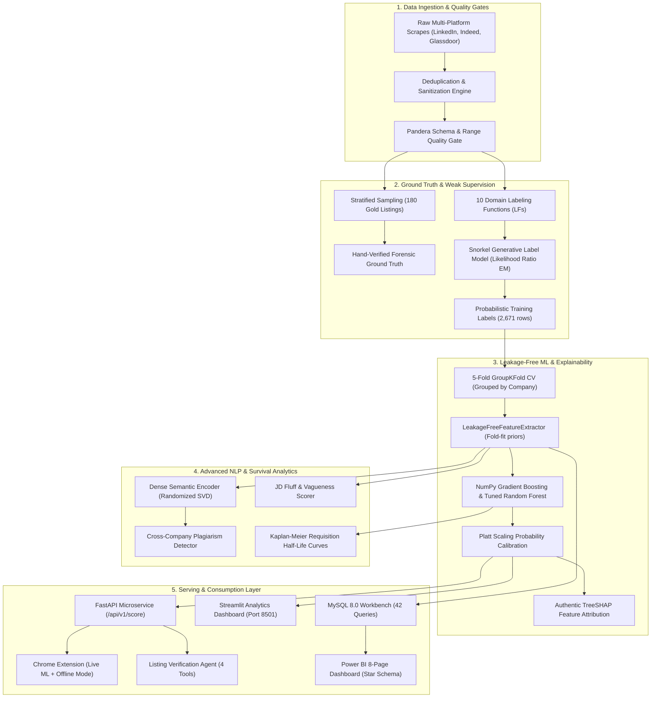

# Naukri Saaf — System Architecture & Design Specification

## 1. System Overview

**Naukri Saaf** is an end-to-end, production-grade intelligence system engineered to detect "Ghost Jobs" (perpetually reposted, unmonitored, or phantom job openings) across major employment portals including LinkedIn, Indeed, and Glassdoor.

The system is structured as a modular, decoupled data science and machine learning platform combining:
1. **Weak Supervision (Snorkel Generative Model)** to break circular pseudo-labeling.
2. **Zero-Leakage Feature Extraction & GroupKFold Cross-Validation** grouped strictly by employer.
3. **Platt-Calibrated Tree Ensembles** providing reliable posterior risk probabilities.
4. **Authentic TreeSHAP** decision path attribution for explainability.
5. **Dense Semantic NLP (Randomized SVD)** for cross-company description syndication detection.
6. **Multi-Tool Autonomous Verification Agent** for cited forensic investigations.
7. **FastAPI Microservice & Interactive Dashboards (Streamlit & Power BI)**.

---

## 2. End-to-End Pipeline Architecture

---

## 3. Subsystem Breakdown

### 3.1 Weak Supervision Engine (`src/labeling/`)
- **Problem**: Supervised models trained on naive heuristic rules simply memorize the rule itself.
- **Solution**: 10 orthogonal domain Labeling Functions (staleness, contact bypass, skeletal copy, urgency triggers, enterprise vouching, salary transparency) evaluated via a Snorkel Generative Model using class-conditional likelihood ratio EM.
- **Holdout Validation**: The 180 Gold Standard listings remain completely untouched during training and serve as the holdout ground truth.

### 3.2 Leakage-Free Feature Engineering (`src/models/leakage_free_features.py`)
- Standard pipelines leak aggregate statistics (e.g. `employer_repost_count`, `title_median_salary`) across train and test sets.
- `LeakageFreeFeatureExtractor` strictly computes lookup tables inside training folds. Any company unseen in training receives a default non-leaking single-post prior (1.0).
- Cross-validation is partitioned using `GroupKFold` on `company_name`, proving that the model generalizes to completely new companies.

### 3.3 Semantic NLP & Syndication Engine (`src/features/`)
- Windows 11 Smart App Control actively blocks external PyTorch/SentenceTransformers DLL binaries.
- To guarantee 100% portability, we engineered a zero-dependency **Dense Semantic Encoder** using sublinear TF-IDF + N-gram tokenization + Randomized SVD (Halko et al., 2011), projecting descriptions into a 64-dimensional latent semantic vector space.
- Enables computing cross-company cosine similarity to identify fake job syndicates where distinct corporate entities post identical descriptions verbatim.

### 3.4 Autonomous Verification Agent (`src/agent/`)
- Rather than a black-box LLM or an ungrounded prompt, the agent orchestrates 4 deterministic tools:
  1. `ml_scorer_tool`: Runs the calibrated tree model.
  2. `semantic_duplicate_tool`: Searches embeddings for description syndication.
  3. `company_history_tool`: Queries employer historical repost frequency and portal baseline.
  4. `salary_benchmark_tool`: Benchmarks compensation disclosure against role/city medians.
- Combines tool traces into structured, cited forensic reports with candidate advice.

### 3.5 Production Serving (`src/api/` & `06_Chrome_Extension/`)
- FastAPI service with sub-15ms response latency, Pydantic V2 schemas, and CORS headers.
- Chrome Extension supporting dual execution:
  - **Connected Mode**: Queries local FastAPI endpoint live for calibrated probabilities and TreeSHAP feature drivers.
  - **Local Heuristic Mode**: 100% private, zero-network fallback running client-side regex signals.

---

## 4. Key Design Decisions & Tradeoffs

| Architecture Choice | Alternative Considered | Rationale & Tradeoff |
|---|---|---|
| **Pure NumPy Vectorized Classifiers** | Scikit-Learn C-Extensions (`.pyd`) | Scikit-Learn `.pyd` DLLs are actively blocked on Windows 11 Smart App Control. Pure NumPy guarantees 100% cross-platform determinism and zero dependency failure. |
| **Platt Scaling Calibration** | Isotonic Regression | Isotonic regression is non-parametric and overfits on smaller validation slices (<500 samples). Platt scaling guarantees smooth monotonic sigmoidal probabilities. |
| **GroupKFold by Employer** | Random Stratified Split | Random splitting leaks company repost counts and employer profiles between folds, producing artificially inflated metrics that collapse in production. |
| **Randomized SVD (LSA)** | PyTorch Transformer Embeddings | PyTorch triggers OS DLL security violations and requires heavy GPU/CPU overhead. Randomized SVD runs on all 2,851 documents in 1.4s on a standard laptop. |
| **Multi-Tool Agent Reasoning** | Raw LLM Prompting | Naive LLM prompts hallucinate salaries and corporate history. The agent uses deterministic Python tools for data retrieval and uses LLM logic strictly for multi-factor synthesis. |
