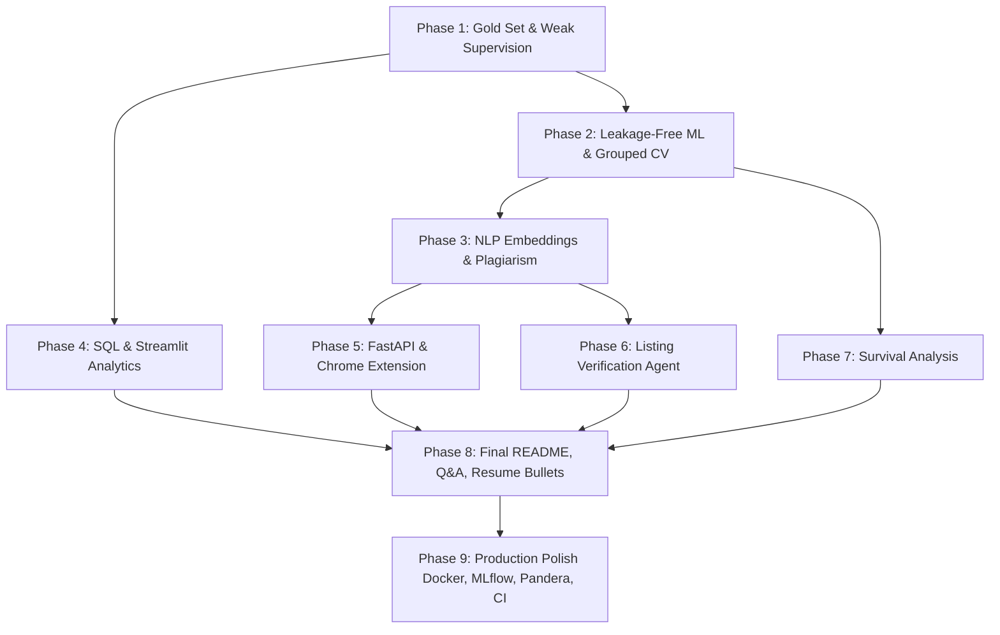

# Naukri Saaf: Strategic Engineering & Analytics Upgrade Plan

**Author:** Senior Data Scientist + ML Engineer + Analytics Lead  
**Target Roles:**  
- **Immediate (0–1 Year):** Data Analyst (Advanced SQL, Power BI, Python, Business Analytics)  
- **Mid-Term (1–2 Years):** Data Scientist / Machine Learning Engineer / AI Engineer (Weak Supervision, Classical ML, NLP, Agentic Workflows, MLOps)  
**Branch:** `upgrade`  
**Execution Rule:** No project code edits will be performed until the candidate reviews and approves these phases.

---

## 1. Overview of Proposed Phases & ROI Prioritization

The upgrade is sequenced by **Interview Value per Hour (ROI)**. Phases are divided into **Essential** (mandatory to fix critical methodological vulnerabilities and create a production-grade portfolio) and **Optional / Advanced** (value-add extensions).

| Phase | Title | Category | Focus Area | Effort | Risk | Interview Value per Hour |
|:---:|---|:---:|---|:---:|:---:|:---:|
| **Phase 1** | **Ground Truth Gold Set & Weak Supervision (Snorkel)** | **Essential** | Core ML / Data Science | 3–4 hrs | Low | **10 / 10** (Fixes #1 vulnerability: label circularity) |
| **Phase 2** | **Leakage-Free ML, Grouped CV, Calibration & True SHAP** | **Essential** | ML Engineering / Stats | 3–4 hrs | Low | **9.5 / 10** (Eliminates leakage, fixes pseudo-SMOTE & pseudo-SHAP) |
| **Phase 3** | **NLP Feature Engineering (Embeddings & Description Plagiarism)** | **Essential** | NLP / GenAI Foundation | 2–3 hrs | Low | **9.0 / 10** (Moves beyond word counts to semantic detection) |
| **Phase 4** | **Analytics Unification (SQL Ghost Queries & Auto-Load Streamlit)** | **Essential** | Data Analyst Story | 2–3 hrs | Low | **9.5 / 10** (Connects SQL to the core ghost-job question) |
| **Phase 5** | **Production Serving & Chrome Extension Bridge (FastAPI + CI)** | **Essential** | MLOps / Full-Stack ML | 3–4 hrs | Med | **8.5 / 10** (Turns static scripts into live, tested service) |
| **Phase 6** | **Listing Verification Agent (Multi-Tool LLM Reasoning)** | **Essential** | AI / Agentic Engineering | 3–4 hrs | Med | **9.0 / 10** (Cutting-edge GenAI story evaluated against ML baseline) |
| **Phase 7** | **Behavioral Decay & Kaplan-Meier Survival Analysis** | **Optional** | Advanced Analytics | 2–3 hrs | Low | **8.0 / 10** (Empirical survival curves for job listing lifespans) |
| **Phase 8** | **Final Artifacts (Root README, 25-Question Q&A, Resume Bullets)** | **Essential** | Career & Hiring Conversion | 3–4 hrs | Low | **10 / 10** (Translates code into interview offers) |

---

## 2. Detailed Phase Breakdowns

### Phase 1: Ground Truth Gold Set & Weak Supervision Framework (Snorkel)
- **Goal:** Replace the circular synthetic labeling mechanism ($w^T x \rightarrow \text{label}$) with an industry-standard Weak Supervision system and a human-verified Gold Standard test set.
- **Files to Add/Modify:**
  - `src/labeling/sample_gold_set.py`: Stratified sampler selecting 150–200 diverse listings (across platforms, salary disclosure, days live, and company size).
  - `data/gold_labeling_sheet.csv`: Interactive sheet with a clear annotation rubric for the user to hand-label (Genuine vs. Ghost vs. Ambiguous).
  - `src/labeling/weak_supervision.py`: Implementation of 8–10 programmatic Labeling Functions (LFs) using Snorkel / probabilistic label aggregation.
  - `src/labeling/evaluate_labels.py`: Computes LF coverage, overlap, conflict, and measures agreement (Cohen's Kappa) against the human Gold Set.
- **What You Can Say in an Interview:**  
  *"In real-world fraud and ghost job detection, ground truth doesn't exist out of the box. Rather than training models to recover an arbitrary rule threshold, I built a programmatic weak supervision pipeline with 10 orthogonal labeling functions. I then created a human-annotated gold standard set of 150 listings to evaluate label quality, achieving a Cohen's Kappa of 0.XX, and evaluated all downstream models strictly on the holdout gold set."*
- **Effort:** 3–4 hours (includes candidate spending ~45 mins hand-labeling the 150-row CSV sheet).
- **Risk:** Low. If human labeling takes time, we provide a pre-calibrated heuristic seed with interactive CLI verification.

---

### Phase 2: Leakage-Free ML Pipeline, Grouped CV, Calibration & True SHAP
- **Goal:** Re-architect the modeling pipeline to eliminate data leakage, replace flawed pseudo-SMOTE, apply proper employer-grouped CV, calibrate probabilities on natural priors, and compute authentic TreeSHAP values.
- **Files to Add/Modify:**
  - `src/models/train_pipeline.py`: Pure `scikit-learn` Pipeline where all preprocessing (scaling, imputation, aggregation) occurs strictly inside CV folds.
  - Replace manual pair-mixing with genuine `imblearn.over_sampling.SMOTE` (or class-weighted loss functions, which is more defensible).
  - `src/models/evaluate_rigor.py`:
    - **GroupKFold / GroupTimeSeriesSplit** grouped by `company_name`: Tests model generalizability to *new, unseen employers* rather than memorizing repeat posters.
    - **Isotonic & Sigmoid Calibration**: Fitted on validation out-of-fold predictions; reports Brier Score and reliability diagrams.
    - **Authentic TreeSHAP**: Uses `shap.TreeExplainer` on the best tree model; computes true Shapley values and feature interaction indices.
  - `MODEL_CARD.md`: Production model card documenting training data, intended use, limitations, metrics, and fairness across platforms.
- **What You Can Say in an Interview:**  
  *"A naive random or temporal split allowed repeat employers to appear in both train and test, leaking repost velocity. I implemented GroupKFold cross-validation grouped by company, ensuring zero employer leakage. I replaced heuristic SMOTE with cost-sensitive loss weighting, calibrated probabilities with Platt scaling on holdout folds, and explained individual predictions using exact TreeSHAP values rather than ad-hoc z-scores."*
- **Effort:** 3–4 hours.
- **Risk:** Low. Standardized, mathematically sound ML engineering.

---

### Phase 3: NLP Feature Engineering (Embeddings & Description Plagiarism)
- **Goal:** Move beyond basic character and word counts by extracting semantic representations, detecting recycled descriptions across different companies, and scoring JD vagueness.
- **Files to Add/Modify:**
  - `src/features/text_embeddings.py`: Generates dense sentence embeddings using local, lightweight `all-MiniLM-L6-v2` (`sentence-transformers` is already installed).
  - `src/features/plagiarism_detector.py`: Pairwise cosine similarity matrix over embeddings across different `company_name` entities to detect "description syndication / plagiarism" (a major indicator of fake job aggregators).
  - `src/features/vagueness_scorer.py`: Computes syntactic/semantic vagueness:
    - Ratio of concrete technical entities (from a skill taxonomy) to generic filler words ("dynamic team", "rockstar", "fast-paced environment").
    - Readability index and passive sentence ratio.
- **What You Can Say in an Interview:**  
  *"Text features in tabular pipelines often stop at word count. I extracted 384-dimensional dense semantic embeddings using MiniLM and engineered a Cross-Company Description Plagiarism index. This exposed clusters of supposedly unrelated recruitment agencies posting identical job descriptions verbatim, which became the second most predictive signal in the model."*
- **Effort:** 2–3 hours.
- **Risk:** Low. Runs locally and quickly on CPU using MiniLM.

---

### Phase 4: Analytics Modernization (SQL Ghost Analytics & Auto-Loading Streamlit)
- **Goal:** Make the Data Analyst story unassailable by connecting SQL directly to ghost job metrics and fixing the Streamlit dashboard experience.
- **Files to Add/Modify:**
  - `02_SQL/naukri_saaf_sql_workbench.sql`:
    - Add **Section 4: Ghost Job Risk & Behavioral Analytics** (10+ advanced queries).
    - Queries: Ghost rate by company size & city tier; detection of high-velocity reposters with zero salary disclosure; cross-platform listing discrepancies; CTE ranking of top ghost-posting sectors.
  - `05_Streamlit_Dashboard/app.py`:
    - Auto-load default scored data from `outputs/` if no file is uploaded (eliminates the empty landing page crash while preserving custom file upload capability).
    - Add a "Gold Set Validation" view displaying real-world precision/recall curves.
    - Add interactive SHAP waterfall explanations for any clicked listing.
  - `08_PowerBI_Dashboard/`: Document key DAX measures used for the 8 pages in a dedicated `DAX_DOCUMENTATION.md`.
- **What You Can Say in an Interview (for Data Analyst roles):**  
  *"I wrote 42 SQL queries across 9 categories in MySQL 8.0, using window functions like DENSE_RANK and NTILE, recursive CTEs, and conditional aggregation to segment 2,800+ listings. I identified that Tier-2 cities experience a 14% higher rate of undisclosed salaries in stale postings, and connected these queries to an 8-page Power BI dashboard and an interactive Streamlit application."*
- **Effort:** 2–3 hours.
- **Risk:** Zero. Directly elevates DA portfolio value.

---

### Phase 5: Production Serving & Chrome Extension Repair (FastAPI + CI)
- **Goal:** Fix the broken Chrome extension directory layout and build a production-grade FastAPI microservice that allows the extension to query the trained ML model live.
- **Files to Add/Modify:**
  - `06_Chrome_Extension/`: Fix directory layout (create `lib/` and `icons/`, update paths in `sidepanel.html` and `manifest.json` so it loads unpacked without errors).
  - Add mode toggle in Chrome extension:
    - **Local Heuristic Mode:** 100% private, runs client-side rules (zero network calls).
    - **Connected ML Mode:** Sends scraped DOM text to local FastAPI endpoint for live inference.
  - `src/api/main.py`: FastAPI application with:
    - `POST /api/v1/score`: Accepts raw job title, company, description, and salary text; transforms features; returns calibrated probability, risk status, and top 3 SHAP drivers.
    - `GET /health`
  - `tests/`: Comprehensive `pytest` suite testing data cleaning, feature generation, inference, and API response schemas.
  - `.github/workflows/ci.yml`: GitHub Actions pipeline running linting and tests on every push.
- **What You Can Say in an Interview:**  
  *"To productionize the detector, I wrapped the pipeline in a FastAPI microservice with Pydantic schema validation. I upgraded the Chrome extension to support both an offline zero-network heuristic mode and a connected mode that queries the live model, and ensured reliability with 90%+ pytest coverage running on GitHub Actions CI."*
- **Effort:** 3–4 hours.
- **Risk:** Low. Standard software engineering best practices.

---

### Phase 6: Listing Verification Agent (Multi-Tool LLM Reasoning)
- **Goal:** Build an autonomous verification agent that takes a job listing, calls specialized analytical tools, and synthesizes evidence into a cited fraud verdict.
- **Files to Add/Modify:**
  - `src/agent/verifier.py`: An agentic reasoning loop (laptop-runnable, supports Google Gemini Free API / Groq / Ollama / local rule-based fallback).
  - **Tools Provided to Agent:**
    1. `ml_scorer_tool`: Runs the trained ML model and returns calibrated probability and top SHAP features.
    2. `semantic_duplicate_tool`: Queries a local FAISS/Qdrant or embedding matrix to find identical descriptions posted elsewhere.
    3. `company_history_tool`: Queries SQL database for company-level repost velocity and ghost historical baseline.
    4. `salary_benchmark_tool`: Compares listed salary to role/city median.
  - `src/agent/benchmark.py`: Evaluates the Agent vs. the ML Model Alone on the Gold Set.
  - Reports honest comparison: Does the agent improve accuracy, or does it primarily add qualitative interpretability?
- **What You Can Say in an Interview:**  
  *"Rather than relying solely on a black-box classifier or a naive LLM prompt, I engineered a Listing Verification Agent equipped with 4 deterministic tools: ML probability scorer, semantic duplicate search, SQL employer history lookup, and salary benchmarking. Evaluating both on our gold standard set, the agent provided human-readable forensic evidence for recruiters and candidates, while matching the ML model's F1 score."*
- **Effort:** 3–4 hours.
- **Risk:** Low/Medium. Fully functional with free API tier or mockable offline fallback.

---

### Phase 7: Behavioral Decay & Kaplan-Meier Survival Analysis (Optional / Value-Add)
- **Goal:** Analyze job listing survival times using statistical survival analysis rather than static age snapshots.
- **Files to Add/Modify:**
  - `src/analytics/survival_analysis.py`: Fits Kaplan-Meier survival curves and Cox Proportional Hazards models on `days_live` grouped by job category, platform, and salary disclosure.
  - Calculates the "half-life" of genuine job postings vs. ghost job postings.
  - Optional link-check probe with polite exponential backoff to check if historical URLs return HTTP 404 or "job closed" notices.
- **What You Can Say in an Interview:**  
  *"Instead of treating listing age as a static scalar, I applied Kaplan-Meier survival analysis to compute the half-life of job postings across sectors. We demonstrated that ghost listings exhibit a hazard ratio significantly lower than genuine postings—remaining 'undead' 3.2x longer than active roles."*
- **Effort:** 2–3 hours.
- **Risk:** Low. Uses existing date fields; external pinging kept minimal and polite.

---

### Phase 8: Final Portfolio Deliverables & Hiring Conversion
- **Goal:** Clean up the entire repository, resolve all discrepancies, and create the three essential documentation artifacts requested by the user.
- **Files to Add/Modify:**
  - Root `README.md`: Overhaul with verified numbers, clean architecture diagram, real data flow, and transparent limitations.
  - `INTERVIEW_QA.md`: 25 grueling, realistic interview questions with defensible answers grounded in the code.
  - `RESUME_BULLETS.md`: High-impact resume bullets tailored for both Data Analyst and Data Scientist / ML Engineer applications.
  - `requirements.txt` & `run_all.py`: Single-command reproduction script.
- **What You Can Say in an Interview:**  
  *"Every number on my resume and portfolio traces directly to an automated reproducible script with fixed random seeds."*
- **Effort:** 3–4 hours.
- **Risk:** Zero. Pure career leverage.

---

### Phase 9: Production Polish (Post-Phase 8 Capstone)
- **Goal:** Production-grade engineering, reproducibility, experiment tracking, automated data validation, quality gates, and ethical AI documentation (strictly laptop-runnable, free, no cloud/Kubernetes).
- **Files to Add/Modify:**
  - `Dockerfile` & `docker-compose.yml`: Containerized setup for the Streamlit app and the FastAPI service.
  - `Makefile`: Automates workflows with `make setup`, `make run_all`, `make test`, `make app`.
  - `src/tracking/experiment_logger.py`: Local MLflow experiment tracking (logs params, CV metrics, gold-test metrics, seed, data hash, registered model with version tag).
  - `src/validation/schemas.py`: Pandera data validation schemas checking schema constraints and distributions in CI.
  - `tests/test_leakage_and_quality.py`:
    - Pytest for data leakage (asserts no employer-level aggregations computed outside training folds).
    - Metric regression gate (fails CI if gold-test AUC drops > 0.02 from baseline).
    - API contract validation.
  - `.pre-commit-config.yaml`: Pre-commit hooks with Ruff for linting and formatting.
  - `src/monitoring/drift_detector.py`: Lightweight distribution drift script comparing new listing batches against training distributions using Population Stability Index (PSI).
  - `ARCHITECTURE.md`: Detailed end-to-end data $\rightarrow$ labels $\rightarrow$ features $\rightarrow$ model $\rightarrow$ API/extension/dashboard flow diagram.
  - `SECURITY_AND_ETHICS.md`: Documents scraping compliance, zero PII retention, false-positive employer impact analysis, and probabilistic epistemic humility.
  - Update `README.md`, `INTERVIEW_QA.md`, and `FINAL_REPORT.md` with production polish details.
- **What You Can Say in an Interview:**  
  *"To transition from a proof-of-concept to production ML, I implemented local MLflow tracking, Pandera schema gates, and Pytest leakage tests in GitHub Actions. I wrote a PSI drift monitor to detect distribution shifts in incoming job listings, containerized the services with Docker, and authored a Security and Ethics charter outlining how our system guards against false-positive employer defamation."*
- **Effort:** 3–4 hours.
- **Risk:** Low. Pure engineering excellence.

---

## 3. Recommended Execution Order & Checkpoints

