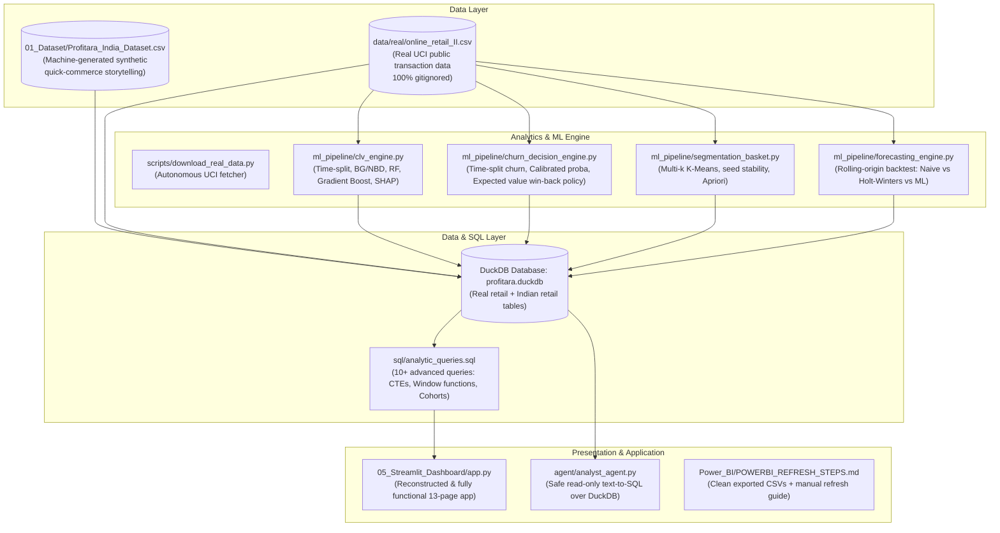

# UPGRADE PLAN: Profitara — Retail BI & Customer Analytics

**Date**: October 2026  
**Status**: Ready for autonomous execution  
**Target Roles**: Data Analyst (now) → Data Scientist / ML Engineer (1–2 years)

---

## Architecture of Upgraded Repository

---

## Detailed Phase Execution Roadmap

### Phase 0: Truth Cleanup & Claims Ledger
- Initialize `CLAIMS_LEDGER.csv` capturing every claim across README, BA Docs, Excel, SQL, and resume.
- Fix US Superstore and USD claims in SQL and documentation; remove references to phantom XGBoost/Prophet unless actually built and shipped.
- Write `GITHUB_PROFILE_README_FIXES.md` providing surgical replacements for misleading profile claims.

### Phase 1: Data Honesty & Real Dataset Ingestion
- Explicitly label `01_Dataset/Profitara_India_Dataset.csv` as a machine-generated synthetic quick-commerce dataset used for dashboard UI storytelling.
- Build `scripts/download_real_data.py` to fetch UCI Online Retail II (real UK non-store online retail dataset: ~1,000,000 transactions, 2009–2011).
- Configure `.gitignore` to ensure real external datasets are gitignored.
- **GATE 1**: If the dataset download fails, STOP and report the exact URL.

### Phase 2: Customer Lifetime Value (CLV) Done Properly
- Construct a strict time-based split:
  - Observation window: First 9 months (features engineered strictly prior to cut-off date).
  - Target window: Next 3 months (actual customer spend).
- Prevent target identity leakage: Do NOT include `AvgOrderValue` or target-period frequency in features.
- Evaluate models:
  1. Naive baseline: Predict overall mean spend.
  2. Linear regression baseline.
  3. BG/NBD + Gamma-Gamma probabilistic model (clean implementation).
  4. Random Forest Regressor.
  5. Gradient Boosting Regressor (HistGradientBoostingRegressor).
- Compute $R^2$, MAE, RMSE with 95% bootstrap confidence intervals.
- Decile calibration plot: Actual vs predicted spend per decile.
- Feature importance using real SHAP values (`shap.TreeExplainer`).

### Phase 3: Churn as a Decision & Win-Back Optimization
- Define churn rigorously: Customer with purchase in observation window has 0 purchases in prediction window.
- Ensure strict time-split integrity: Zero future information in features.
- Model churn probability with Logistic Regression and Gradient Boosting; calibrate probabilities (Platt scaling / isotonic).
- Decision layer:
  $$\text{Expected Value of Win-back} = P(\text{churn}) \times \text{predicted CLV} \times \text{margin} - \text{campaign cost}$$
- Target selection under budget constraint ($B$).
- Backtest policy against naive baselines:
  - Rule 1: Contact all customers.
  - Rule 2: Contact based on top RFM recency only.
  - Rule 3: Expected value policy.
- Store assumptions (campaign cost, response rate, margin) in `config/business_assumptions.yaml`.
- Generate sensitivity matrix across varying response rates and costs.

### Phase 4: Segmentation & Basket Analysis
- K-Means evaluation across $k \in [2, 8]$: Elbow inertia, silhouette score, and cluster stability across 5 random seeds.
- Define actionable business segments (e.g. Champions, Loyal, At-Risk, Hibernating).
- Run Apriori on real retail transaction baskets: Verify support, confidence, and lift thresholds; document surviving rules.

### Phase 5: Time-Series Forecasting
- Aggregate revenue to weekly/monthly frequency.
- Rolling-origin backtest (walk-forward CV) with 3 folds.
- Benchmark:
  1. Seasonal Naive baseline.
  2. Holt-Winters Exponential Smoothing.
  3. ML autoregressive model (Random Forest / Ridge with lag features).
- Report honest MAPE and RMSE for each fold; state clearly where naive wins or loses.

### Phase 6: SQL & Analytics Layer + Dashboard Integration
- Build `profitara.duckdb` database containing:
  - `real_transactions`, `real_customers`, `real_clv_features`, `real_churn_predictions`
  - `india_transactions`, `india_customer_rfm`
- Write `sql/analytic_queries.sql` with 10+ advanced queries:
  1. Cohort retention matrix (CTE + pivot).
  2. Repeat purchase rate by quarterly signup cohort.
  3. Pareto 80/20 customer revenue concentration.
  4. RFM segment revenue share and AOV.
  5. Month-over-month revenue growth using `LAG()`.
  6. Running cumulative revenue per customer using window frames.
  7. High-risk churn revenue exposure.
  8. Category margin elasticity ranking.
  9. Product reorder rate analysis.
  10. Moving 7-day / 30-day average sales.
- Reconcile every dashboard metric against SQL and pandas outputs.
- Rebuild `05_Streamlit_Dashboard/app.py` restoring all 13 pages cleanly connected to DuckDB and verified outputs.
- Write `POWERBI_REFRESH_STEPS.md` and export clean CSVs for Power BI.

### Phase 7: Retail Analyst Agent (Text-to-SQL)
- Build `agent/analyst_agent.py` to translate natural language into read-only SQL over DuckDB.
- Guardrails:
  - Schema-aware prompt.
  - SELECT-only validation parser (strictly reject `DROP`, `UPDATE`, `INSERT`, `ALTER`, `DELETE`, `EXEC`).
  - Automatic `LIMIT 100` enforcement.
  - Outputs tabular data and auto-charting logic.
  - LLM provider via `.env` (Gemini API with fallback / offline fixture mode).
- Generate ~40 question + reference SQL pairs in `QA_PAIRS_TO_REVIEW.csv` marked "machine-generated, unreviewed".
- **GATE 2**: STOP and request user review of `QA_PAIRS_TO_REVIEW.csv` before reporting benchmark execution accuracy.

### Phase 8: Quality Assurance & Testing
- Unit tests via `pytest`:
  - `test_leakage.py`: Assert zero future timestamps in training feature window.
  - `test_data_integrity.py`: Verify financial totals match between SQL and pandas.
  - `test_agent_guard.py`: Assert SQL parser blocks destructive queries and enforces read-only.
- GitHub Actions CI workflow (`.github/workflows/ci.yml`).
- Create single-command runner `run_all.py`.

### Phase 9: Deliverables & Interview Defense
- Update root `README.md` (clean, truthful, free of marketing hype or emojis).
- `RECRUITER_ONE_PAGER.md`: 60-second summary for HR/recruiters.
- `INTERVIEW_QA.md`: 25 technically grounded questions and answers.
- `WALKTHROUGH.md`: Comprehensive defense guide for every technical choice.
- `RESUME_BULLETS.md`: Data Analyst and Machine Learning resume bullets with mapped citations.
- Complete `CLAIMS_LEDGER.csv` and write `FINAL_REPORT.md`.
